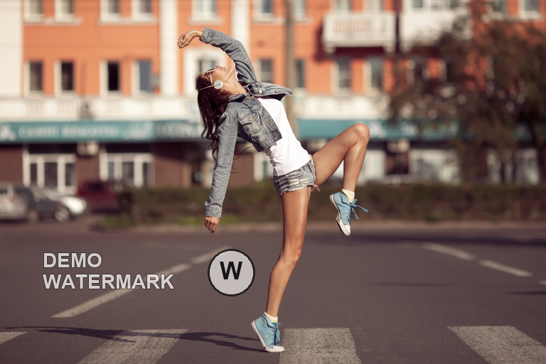
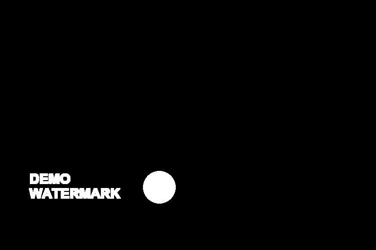
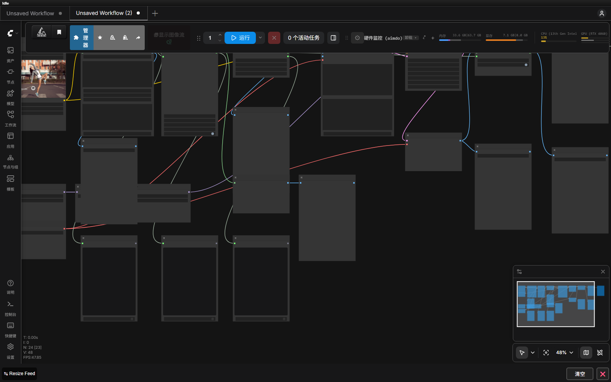

# ComfyUI Qwen Watermark

一套在本机 ComfyUI 运行的去水印工作流：先用 Qwen3-VL 定位文字、Logo、马赛克、矩形色块和贴纸，再用 SAM 细化不规则轮廓，给 Qwen Image 2.1 提供带上下文的局部图，最后只把选区贴回原图。未被遮罩覆盖的像素会被逐像素保护。

> 仅处理你拥有版权或已获得授权的图片。遮挡下完全不存在的真实像素无法被恢复，模型只能根据上下文生成合理内容。

## 效果示例

这是项目内置的可公开演示图。左图含两行文字水印和一个圆形 Logo，右图为去除结果，中间的黑白图是用于保护范围的遮罩。

<table>
<tr>
<td></td>
<td></td>
<td></td>
</tr>
<tr><td align="center">输入：文字 + Logo</td><td align="center">输出：局部重建</td><td align="center">白色区域：允许编辑</td></tr>
</table>

下面是实际导入 ComfyUI 后的节点图。完整说明见 [`docs/参数与提示词.md`](docs/参数与提示词.md)。



## 适用范围

| 遮挡类型 | 推荐路径 | 关键设置 |
| --- | --- | --- |
| 普通文字、Logo、小型半透明水印 | `auto_qwen` + `sam` | `dilation=8~12`，自适应外扩开启 |
| 马赛克、矩形花纹、纯色色块 | `manual_boxes` + `box` | 手动框覆盖完整硬边，`expand=16~24` |
| 不规则贴纸、动物/人物贴片 | `manual_boxes` + `sam` | `dilation=12`，大型贴纸自动增至约 `32~48` |
| 边缘复杂或贴近必须保留的细节 | `manual_mask` | 画白需要移除的区域，必要时关闭自适应外扩 |

工作流不会把整张图交给编辑模型，而是保留上下文的局部裁剪；`QWMComposite` 只在最终遮罩内合成，并检查选区外最大像素差。详细参数、提示词模板和故障排查见 [参数与提示词指南](docs/参数与提示词.md)。

## 快速开始

### 1. 准备 ComfyUI 和模型

建议使用 ComfyUI 0.38.2 或更新版本，并确认当前版本提供官方节点 `TextEncodeQwenImage21`、`QwenImage21Cache`。模型文件不包含在仓库或压缩包中，请按下表放置：

| 文件 | 目录 |
| --- | --- |
| `qwen_image_2.1_bf16.safetensors` | `models/unet/`（部分版本也叫 `diffusion_models/`） |
| `qwen3vl_8b_int8_convrot.safetensors` | `models/clip/` 或 `models/text_encoders/` |
| `qwen_image_2.1_vae_bf16.safetensors` | `models/vae/` |
| `sam_vit_b_01ec64.pth` | `models/sams/` |

### 2. 安装自定义节点

`QWMDetect`、`QWMRefineMask`、`QWMPrepare`、`QWMComposite` 是本项目新增的自定义节点，不是 ComfyUI 内置节点。只导入 JSON 会出现红色缺失节点；请运行：

```powershell
python scripts/install_nodes.py --comfy-root "E:\ComfyUI-aki-v3\ComfyUI-aki-v3\ComfyUI"
```

或者下载 Releases 中的 `Qwen-Watermark-Workflow-*.zip`，解压后运行包内 `install.py`。安装后重启 ComfyUI，并在浏览器按 `Ctrl+F5`。

### 3. 导入并运行

1. 导入 `workflows/qwen21_watermark.json`。
2. 在“01 上传原图”节点重新选择图片。
3. 普通水印先保持 `auto_qwen`；矩形色块切换到 `manual_boxes + box`；不规则贴纸用 `manual_boxes + sam`，边缘复杂时用 `manual_mask`。
4. 运行后查看“定位预览”“细化遮罩预览”“左右对比”和报告节点。

只想确认自动框选时，导入 `workflows/qwen_watermark_detection.json`。命令行批处理示例：

```powershell
python scripts/run_workflow.py "C:\图片\原图.png" --output outputs\my_image
python scripts/run_workflow.py samples\demo_watermarked.png --detect-only --output outputs\detection
```

## 结果与验证

- 本机环境：ComfyUI 0.38.2、前端 1.53.6、RTX 4060 Laptop 8 GB。
- 普通文字 + Logo 回归：两处 `effective_dilation=12`，选区外最大差异 `0`。
- 不规则贴纸回归：SAM 允许轮廓在安全边界内越过检测框，自动外扩示例为 `32 px`，选区外最大差异 `0`。
- 手绘遮罩回归：大型区域自适应外扩 `38 px`，选区外最大差异 `0`。
- Python 回归测试：`20 passed`。

完整实测数据见 [`TEST_RESULTS.md`](TEST_RESULTS.md)。

## 项目结构

```text
custom_nodes/ComfyUI-Qwen-Watermark/   四个自定义节点
workflows/                              可导入的 UI/API 工作流
scripts/                                安装、运行、构建和验证脚本
packaging/                              分享包说明、安装器和许可证
docs/参数与提示词.md                    参数表、提示词模板、排错指南
samples/                                不含模型的公开演示素材
tests/                                  处理逻辑和工作流结构测试
```

## 许可证

仓库代码按 [`packaging/LICENSE`](packaging/LICENSE) 发布。Qwen、SAM 及其他模型权重遵循各自许可证；本项目不重新分发模型权重。
